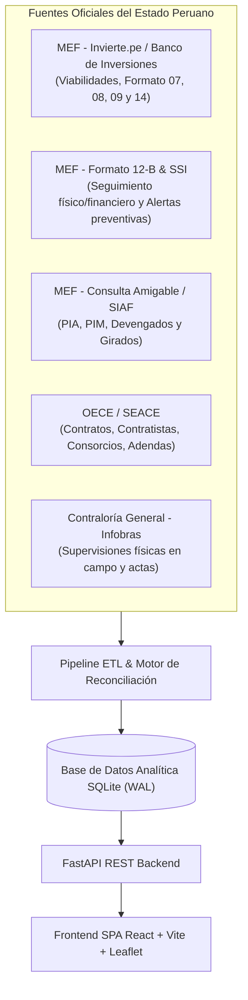

<p align="center">
  
</p>

<h1 align="center">Observatorio de Obras Públicas del Perú 🇵🇪</h1>

<p align="center">
  <strong>Plataforma integral de auditoría cívica, georreferenciación y transparencia en tiempo real para fiscalizar las obras públicas del Estado peruano.</strong>
</p>

<p align="center">
  <a href="https://observatorio.cmaquera.com/" target="_blank">
    
  </a>
  
  
  
  
  
  
  
</p>

<p align="center">
  🚀 <strong>Acceso a la plataforma activa:</strong> <a href="https://observatorio.cmaquera.com/" target="_blank"><strong>https://observatorio.cmaquera.com/</strong></a>
</p>

---

## 🧭 Tabla de Contenidos

1. [Acerca del Proyecto](#-acerca-del-proyecto)
2. [El Problema y la Solución](#-el-problema-y-la-solución)
3. [Fuentes Oficiales Reconciliadas](#-fuentes-oficiales-reconciliadas)
4. [Características Principales](#-características-principales)
5. [Arquitectura del Sistema](#-arquitectura-del-sistema)
6. [Estructura del Repositorio](#-estructura-del-repositorio)
7. [Instalación y Puesta en Marcha](#-instalación-y-puesta-en-marcha)
8. [Pipeline ETL de Datos](#-pipeline-etl-de-datos)
9. [Reglas Metodológicas del ISR](#-reglas-metodológicas-del-isr)
10. [Despliegue en Producción](#-despliegue-en-producción)
11. [Licencia](#-licencia)

---

## 🇵🇪 Acerca del Proyecto

En el Perú, miles de obras públicas se encuentran paralizadas, retrasadas o con sobrecostos millonarios. Los portales del Estado (MEF, SEACE, Infobras) suelen presentar la información de forma dispersa, con lenguaje técnico complejo y plataformas protegidas por cortafuegos o CAPTCHAs que dificultan la fiscalización ciudadana.

El **Observatorio de Obras Públicas del Perú** es una iniciativa de datos abiertos y auditoría cívica diseñada para:
* **Traducir** los datos presupuestales, contractuales y de avance físico a un lenguaje claro y comprensible para cualquier ciudadano.
* **Cruzar y reconciliar** automáticamente las bases de datos de distintas entidades públicas para detectar inconsistencias (por ejemplo, pagos financieros avanzados cuando la construcción real está estancada).
* **Priorizar el riesgo** mediante un algoritmo objetivo: el **Índice de Severidad de Riesgo (ISR)**.
* **Geolocalizar** los proyectos para que los usuarios puedan inspeccionar de inmediato las obras de su propio distrito, provincia o departamento.

---

## 🔍 El Problema y la Solución

| El Problema en los Portales Estatales | La Solución del Observatorio |
| :--- | :--- |
| **Datos Dispersos**: MEF registra gastos, SEACE contratos e Infobras inspecciones, sin conexión directa entre sí. | **Reconciliación Automática**: Unimos el CUI (Código Único de Inversión) con los contratos SEACE y reportes MEF en una sola ficha unificada. |
| **Lenguaje Críptico**: Códigos presupuestales, formatos 12-B y términos legales difíciles de entender. | **Diagnóstico Ciudadano**: Semáforos didácticos (*"De cada S/ 100 de presupuesto, se desembolsaron S/ 95 pero la obra va al 12%"*). |
| **Bloqueos WAF y CAPTCHA**: Las consultas manuales en portales sufren caídas y bloqueos de seguridad. | **Ingesta Streaming de Datos Abiertos**: Carga masiva de volcados mensuales (PNDA y estándar OCDS) y endpoints seguros. |
| **Falta de Priorización**: Miles de proyectos listados sin saber cuáles presentan mayor riesgo. | **Índice de Severidad de Riesgo (ISR)**: Semáforo de criticidad (Crítico, Alto, Medio, En Cronograma) calibrado de 0 a 100. |

---

## 🏛️ Fuentes Oficiales Reconciliadas

El sistema se alimenta exclusivamente de repositorios abiertos oficiales del Estado peruano:



1. **Ministerio de Economía y Finanzas (MEF)**:
   - **Banco de Inversiones (Invierte.pe)**: Viabilidad, costos actualizados y Formato 14 (metas físicas por componentes).
   - **Formato 12-B**: Seguimiento de ejecución mensual físico y financiero reportado por las Unidades Ejecutoras.
   - **Sistema de Seguimiento de Inversiones (SSI)**: Catálogo oficial de alertas tempranas de riesgo de obra.
   - **Consulta Amigable (SIAF)**: Presupuestos vigentes (PIA, PIM) y devengados acumulados.
2. **OECE / SEACE (Sistema Electrónico de Contrataciones del Estado)**:
   - Contratos de obra, montos adjudicados, contratistas individuales y consorcios (RUCs y porcentaje de participación).
3. **Contraloría General de la República (Infobras)**:
   - Registro de avances físicos de campo, supervisiones técnicas y estado de obras paralizadas.

---

## 🌟 Características Principales

### 1. 🌓 Soporte Completo de Modo Claro y Modo Oscuro (Light & Dark Mode)
- Conmutador instantáneo (Sol ☀️ / Luna 🌙) con persistencia de preferencia en `localStorage`.
- Paleta de colores homologada y accesible en todas las vistas: tarjetas ejecutivas, gráficos de inversión, mapas, tablas, visores fotográficos y modales de inspección técnica.

### 2. 📍 Detección Inteligente de Ubicación (IP y GPS)
- **Detección silenciosa por IP**: Al ingresar a la plataforma, el sistema detecta de forma no invasiva la región y provincia del visitante para priorizar y mostrar las obras de su localidad de forma predeterminada.
- **Geolocalización por GPS**: Botón de alta precisión con cálculo de radio de tolerancia para centrar la auditoría en el punto exacto del usuario.

### 3. 🛡️ Isotipo Oficial de Auditoría Cívica Peruana
- Emblema vectorial SVG bespoke que integra:
  - Los colores patrios peruanos (escudo squircle rojo institucional con sutil franja central).
  - La silueta estructural de obras públicas (edificación, equipamiento y bases).
  - La **lupa de auditoría ciudadana** con un **check verde esmeralda**, representando la validación activa de la comunidad.
  - Elimina el bug de visualización en navegadores Windows que mostraban el emoji de bandera peruana como una letra "P" solitaria.

### 4. 📊 Dashboard Ejecutivo y Proyectos Críticos
- Cálculo consolidado de indicadores: Presupuesto Total Auditado, Monto en Riesgo Financiero, Obras Críticas y Desfase Promedio en puntos porcentuales (pp).
- Carrusel de **Proyectos Críticos Prioritarios** ordenados por severidad.

### 5. 🗺️ Mapa Interactivo Georreferenciado (Leaflet + OpenStreetMap Gratuito)
- **Basemap 100% Abierto y Gratuito**: Integrado con los servidores oficiales de OpenStreetMap (OSM), eliminando dependencias de APIs de pago o cuotas de terceros (como Carto o Mapbox), con filtros de alto rendimiento para el Modo Oscuro.
- **Recalibración Automática de Lienzo**: Auto-invalidación de tamaño (`invalidateSize`) que garantiza renderizado inmediato y sin mosaicos grises al cambiar de pestaña.
- **Semáforo y Leyenda Integral de 5 Niveles**:
  - 🔴 **Crítico** ($\text{ISR} \ge 70$): Alta urgencia de intervención y fiscalización.
  - 🟠 **Alto** ($50 \le \text{ISR} < 70$): Riesgo considerable de paralización o sobrecosto.
  - 🟡 **Medio** ($30 \le \text{ISR} < 50$): Desviaciones moderadas bajo monitoreo.
  - 🟢 **Normal** ($\text{ISR} < 30$): Ejecución en cronograma y avance regular.
  - ⚪ **Sin Datos / 0%** (Gris): Proyectos en fase preliminar, actos preparatorios de licitación o que aún no registran devengado físico-financiero en el Banco de Inversiones.

### 6. 📋 Ficha Técnica y Diagnóstico para el Ciudadano
Cada obra cuenta con un expediente interactivo estructurado en pestañas:
- **Resumen Ciudadano**: Diagnóstico en 3 bloques didácticos (Plazo de entrega, Dinero gastado vs. Construcción real, y Estado de controversias).
- **Fotos en Terreno**: Galería de fotos oficiales de supervisión técnica extraídas de reportes de campo (imágenes directas y paneles fotográficos en PDF con visor integrado, badges por periodo y avance físico, y avisos de estado claro cuando una obra no dispone de fotos digitales cargadas).
- **Línea de Tiempo & Metas Físicas**: Reconciliación de hitos históricos (perfil, expediente, inicio, entrega) y avance por componentes (infraestructura, supervisión, equipamiento del Formato 14).
- **Contratos & Alertas SSI**: Contratos asociados, consorcios adjudicatarios y motor oficial de alertas del MEF.
- **Documentos & MEF**: Enlaces directos a fichas oficiales de Invierte.pe, SEACE e Infobras sin CAPTCHA.

### 7. 🏢 Directorio de Contratistas y Consorcios SEACE
- Récord de contratos ganados, montos totales adjudicados, composición societaria de consorcios y tasa de proyectos con alertas de riesgo.

### 8. 📥 Exportación Masiva a CSV
- Descarga de datasets filtrados con codificación UTF-8 con BOM para apertura inmediata en Microsoft Excel, Power BI o Python.

---

## 🏛️ Arquitectura del Sistema

```
                  ┌─────────────────────────────────────────────────────────┐
                  │              Fuentes Abiertas Gubernamentales           │
                  │  MEF (Datos Abiertos, SSI, F12B, F09) · SEACE · Infobras │
                  └───────────────────────────┬─────────────────────────────┘
                                              │
                                              ▼
                  ┌─────────────────────────────────────────────────────────┐
                  │                 Pipeline ETL / Runner                   │
                  │   - Ingesta Streaming por lotes (chunked)               │
                  │   - Normalización de Ubigeos y Centroides Geográficos   │
                  │   - Motor de Evaluación de Riesgos (ISR y Alertas SSI)  │
                  │   - Enriquecedor en línea concurrente (ThreadPool)       │
                  └───────────────────────────┬─────────────────────────────┘
                                              │
                                              ▼
                  ┌─────────────────────────────────────────────────────────┐
                  │          Base de Datos Analítica (SQLite WAL Mode)       │
                  │   - Tablas indexadas: inversiones, contratos, documentos│
                  │   - Read-model optimizado para consultas < 20 ms        │
                  └───────────────────────────┬─────────────────────────────┘
                                              │
                                              ▼
                  ┌─────────────────────────────────────────────────────────┐
                  │               FastAPI REST Backend (Python)             │
                  │   - Endpoints `/api/obras`, `/api/dashboard`, `/export` │
                  │   - Generador de Fichas Oficiales y Descargas Seguras   │
                  │   - Cliente HTTP resiliente con pools SSL para el MEF   │
                  └───────────────────────────┬─────────────────────────────┘
                                              │
                                              ▼
                  ┌─────────────────────────────────────────────────────────┐
                  │       Frontend SPA (React 18 + Vite 8 + Tailwind v4)    │
                  │   - Mapa interactivo Leaflet con semáforo de riesgo     │
                  │   - Modo Claro y Oscuro conmutables                     │
                  │   - Geolocalización automática inteligente (IP + GPS)   │
                  └─────────────────────────────────────────────────────────┘
```

---

## 📂 Estructura del Repositorio

```text
observatorio/
├── backend/
│   ├── app/
│   │   ├── etl/
│   │   │   ├── extractor.py         # Descarga y lectura streaming de datasets MEF
│   │   │   ├── transformer.py       # Transformación, cálculo de ISR y normalización
│   │   │   ├── loader.py            # Carga por lotes transaccionales a la BD
│   │   │   ├── enricher.py          # Enriquecimiento con datos de SEACE y F12-B
│   │   │   ├── enrich_db.py         # Reconciliación en línea de proyectos críticos
│   │   │   ├── mef_live_client.py   # Motor de Alertas SSI y cliente en vivo del MEF
│   │   │   ├── document_analyzer.py # Clasificación de causales en cuadernos de obra
│   │   │   └── runner.py            # Script principal de ejecución del pipeline ETL
│   │   ├── routers/
│   │   │   ├── dashboard.py         # KPIs globales y rankings de riesgo
│   │   │   ├── obras.py             # Detalle de obras, línea de tiempo y fotos
│   │   │   ├── empresas.py          # Estadísticas y contratos por contratista
│   │   │   ├── geo.py               # Jerarquía de departamentos, provincias y distritos
│   │   │   └── export.py            # Exportación de datos a CSV
│   │   ├── utils/
│   │   │   └── ubigeo_helper.py     # Diccionario y resolución de coordenadas
│   │   ├── config.py                # Variables de entorno y umbrales de criticidad
│   │   ├── database.py              # Configuración de SQLAlchemy y sesiones
│   │   ├── models.py                # Modelos ORM SQLAlchemy y esquemas Pydantic
│   │   ├── rules.py                 # Algoritmo del Índice de Severidad de Riesgo (ISR)
│   │   └── main.py                  # Instancia principal de la aplicación FastAPI
│   ├── data/
│   │   └── observatorio.db          # Base de datos analítica SQLite pre-poblada
│   ├── Dockerfile                   # Contenedor Docker para FastAPI
│   ├── requirements.txt             # Dependencias del backend Python
│   ├── run_server.py                # Lanzador del servidor Uvicorn
│   ├── test_api.py                  # Pruebas automatizadas de endpoints
│   └── test_downloads.py            # Pruebas automatizadas de descarga de reportes
├── frontend/
│   ├── public/
│   │   └── favicon.svg              # Isotipo vectorial de auditoría cívica
│   ├── src/
│   │   ├── components/
│   │   │   ├── ObservatorioLogo.jsx # Isotipo vectorial SVG institucional
│   │   │   ├── Navbar.jsx           # Cabecera con buscador y selector de tema
│   │   │   ├── GeoFilterBar.jsx     # Selector encadenado y geodetección IP/GPS
│   │   │   ├── MetricCards.jsx      # Tarjetas ejecutivas de KPIs de riesgo
│   │   │   ├── CriticalProjects.jsx # Lista de obras críticas de alta severidad
│   │   │   ├── SectorDistribution.jsx # Desglose de inversión por sector estatal
│   │   │   ├── MapView.jsx          # Mapa Leaflet interactivo con clusters
│   │   │   ├── AllObrasTable.jsx    # Tabla completa de obras con filtros
│   │   │   ├── ContratistasTable.jsx# Directorio de contratistas SEACE
│   │   │   ├── FichaObraModal.jsx   # Modal de expediente técnico y diagnósticos
│   │   │   ├── GaleriaFotosObra.jsx # Visor de fotos de supervisión en terreno
│   │   │   ├── LineaTiempoProyecto.jsx # Hitos de vida del proyecto y metas F14
│   │   │   └── DocumentStrategyModal.jsx # Explicación de acceso a fuentes abiertas
│   │   ├── services/
│   │   │   ├── api.js               # Cliente Axios y endpoints REST
│   │   │   └── geoDetector.js       # Motor de geolocalización por IP y GPS
│   │   ├── App.jsx                  # Componente raíz con estado de tema y vistas
│   │   ├── index.css                # Configuración de Tailwind CSS v4 y variantes
│   │   └── main.jsx                 # Entrypoint de React
│   ├── Dockerfile                   # Multi-stage Dockerfile para React + Nginx
│   ├── nginx.conf                   # Configuración Nginx de producción
│   ├── package.json                 # Dependencias y scripts de Node.js
│   └── vite.config.js               # Configuración del bundler Vite
├── docs/
│   ├── ARQUITECTURA.md              # Documentación técnica en profundidad
│   ├── DESPLIEGUE_DOKPLOY_CLOUDFLARE.md # Manual de despliegue en servidor propio
│   └── REGLAS_AUDITORIA.md          # Manual del algoritmo del ISR
├── docker-compose.yml               # Orquestación de contenedores para producción
├── start_project.ps1                # Script PowerShell de arranque unificado
├── LICENSE                          # Licencia MIT
└── README.md                        # Documentación principal
```

---

## 🚀 Instalación y Puesta en Marcha

### Prerrequisitos
- **Python 3.10 o superior**
- **Node.js 18 o superior** y **npm**
- **Git**

---

### Opción 1: Inicio Rápido Unificado (PowerShell en Windows)
El proyecto incluye un script automatizado que valida el entorno y levanta concurrentemente el Backend y el Frontend:
```powershell
.\start_project.ps1
```
* **Frontend Web**: [http://localhost:5173](http://localhost:5173)
* **Backend API**: [http://127.0.0.1:8000](http://127.0.0.1:8000)
* **Documentación Swagger**: [http://127.0.0.1:8000/docs](http://127.0.0.1:8000/docs)

---

### Opción 2: Inicio Manual Paso a Paso

#### 1. Clonar el repositorio
```bash
git clone https://github.com/cmaquera/observatorio.git
cd observatorio
```

#### 2. Iniciar el Backend (FastAPI)
```bash
cd backend

# (Recomendado) Crear entorno virtual:
python -m venv .venv

# Activar entorno:
# En Windows:
.venv\Scripts\activate
# En Linux / macOS:
source .venv/bin/activate

# Instalar dependencias:
pip install -r requirements.txt

# Iniciar servidor:
python run_server.py
```
> El backend quedará escuchando en `http://127.0.0.1:8000`.

#### 3. Iniciar el Frontend (React + Vite)
En otra terminal:
```bash
cd frontend

# Instalar dependencias:
npm install

# Iniciar servidor de desarrollo:
npm run dev
```
> Abre tu navegador en `http://localhost:5173`.

---

## 🔄 Pipeline ETL de Datos

Para actualizar la base de datos o descargar obras de cualquier departamento del Perú:

```bash
cd backend

# Procesar 500 proyectos del departamento del Cusco:
python -m app.etl.runner --region CUSCO --limit 500

# Procesar proyectos de Lima Metropolitana:
python -m app.etl.runner --region LIMA --limit 1000

# Descargar datos a nivel nacional:
python -m app.etl.runner --region "" --limit 2000

# Carga masiva desatendida de todo el país (sin llamadas en vivo):
python -m app.etl.runner --region "" --limit 0 --skip-enrich
```

---

## 📐 Reglas Metodológicas del ISR

El **Índice de Severidad de Riesgo (ISR)** es un modelo de scoring ponderado que clasifica los proyectos de 0 a 100 puntos en base a 5 factores objetivos:

$$\text{ISR} = (D \times 0.35) + (P \times 0.25) + (F \times 0.15) + (M \times 0.15) + (C \times 0.10)$$

| Dimensión | Ponderación | Criterio de Medición |
| :--- | :---: | :--- |
| **Desfase Financiero vs. Físico ($D$)** | **35%** | Brecha en puntos porcentuales entre el avance pagado y el avance físico certificado. |
| **Plazo Vencido ($P$)** | **25%** | Días transcurridos más allá de la fecha contractual prevista de fin de obra. |
| **Omisión de Formato 12-B ($F$)** | **15%** | Meses consecutivos sin que la Unidad Ejecutora reporte avances en el Banco de Inversiones. |
| **Magnitud Presupuestal ($M$)** | **15%** | Costo actualizado del proyecto (a mayor presupuesto, mayor impacto social y fiscal). |
| **Controversias Contractuales ($C$)** | **10%** | Registro de arbitrajes, contratos resueltos o alertas activas en SEACE. |

### Niveles Semafóricos
* 🔴 **Crítico** ($\text{ISR} \ge 70$): Alta urgencia de intervención y fiscalización.
* 🟠 **Alto** ($50 \le \text{ISR} < 70$): Riesgo considerable de paralización o sobrecosto.
* 🟡 **Medio** ($30 \le \text{ISR} < 50$): Desviaciones moderadas que requieren monitoreo.
* 🟢 **Normal** ($\text{ISR} < 30$): Ejecución en cronograma y avance regular.

---

## 🐳 Despliegue en Producción

El proyecto se encuentra **desplegado y disponible públicamente** en:
👉 **[https://observatorio.cmaquera.com/](https://observatorio.cmaquera.com/)**

Para desplegar tu propia instancia, el repositorio incluye soporte nativo para despliegue en servidores propios con **Docker Compose**, **Dokploy** y túnel seguro con **Cloudflare Tunnel (Zero Trust)**:

```bash
docker compose up -d --build
```

Para una guía paso a paso con configuración de DNS, variables de entorno y túneles sin abrir puertos en el router, consulta:  
👉 **[Guía de Despliegue en Dokploy y Cloudflare](docs/DESPLIEGUE_DOKPLOY_CLOUDFLARE.md)**

---

## 🧪 Pruebas Automatizadas

Verifica la estabilidad de la API y el frontend con las siguientes suites de prueba:

```bash
# Validar endpoints REST y filtros geográficos:
python backend/test_api.py

# Validar generación de reportes y descargas:
python backend/test_downloads.py

# Validar compilación de producción del frontend:
cd frontend
npm run build
```

---

## 📄 Licencia

Este proyecto es de código abierto y se distribuye bajo los términos de la **[Licencia MIT](LICENSE)**.

> **Nota Cívica**: El Observatorio no emite juicios de valor ni reemplaza las auditorías formales de los órganos de control del Estado. Presenta y contrasta los datos declarados oficialmente por las entidades ejecutoras para fortalecer la transparencia y la participación ciudadana en el Perú.
